# FlakeGuard

**Autonomous flaky-test triage for GitHub Actions and pytest, built on the Strands Agents SDK.**

Once a test suite is unreliable, engineers stop trusting every failure - including the real ones. FlakeGuard runs
in the background over a repository's CI history, computes per-test failure probabilities from real run data, and
decides for each failing test whether it is flaky, a genuine regression, confined to one platform, or simply not
yet decidable. When the evidence is strong enough it acts: an issue naming the likely commit, a pull request
quarantining a flake, and - when the test recovers - a pull request reversing that quarantine. When the evidence is
weak it does nothing and says why. It is built for teams whose CI has become noise, and for maintainers who need a
reason, not a verdict.

**The determinism boundary:** the model reasons; it never carries a fact or a number. Every statistic is computed
in Python and pinned into the prompt as ground truth. Scheduling, idempotency, deduplication, rate limiting and the
decision to write are all code. This document is mostly the evidence for that claim.

It is demonstrated against [`dask/distributed`](https://github.com/dask/distributed) - a real, active, public
repository with 89 days of genuinely messy CI history. FlakeGuard never writes to it; artifacts go to this
repository's `scratch` branch instead.

## Why now

On 2026-08-04, dask/distributed PR #9340, titled "[unsupervised AI] fix: propagate task annotations during
worker execution", changed `distributed/worker.py`. At that commit three pre-existing tests in other modules -
`test_worker::test_get_client`, `test_client::test_secede_balances`, `test_actor::test_serialize_with_pickle` -
failed in 17 of 17 cells each, across both matrix partitions, all four operating systems and all five Python
versions. The next commit changed `worker.py` again and all three passed 17/17. None of the three test files
were edited. Runs [30925383561](https://github.com/dask/distributed/actions/runs/30925383561) and
[30970740435](https://github.com/dask/distributed/actions/runs/30970740435).

The volume of machine-generated changes is rising faster than review capacity. Triage that is automatic,
evidence-based and reversible is how a CI signal stays trustworthy under that load.

## The finding: a test matrix is a failure multiplier

Every one of dask/distributed's 34 test-matrix cells is ~98% green. Yet 162 of 191 scheduled runs go red. A
34-cell matrix amplifies rare per-cell flakiness into near-constant failure: each cell flips its own coin, and
the run fails when any one of them lands wrong. No single cell's history reveals this - restricted to one cell,
89 days of data surfaced six tests that ever failed. Pooled across cells, the same window shows 19 tests that
recover repeatedly across three or more commits. This is why per-cell dashboards miss the problem, and why
cross-cell pooling is the right unit of analysis.

Pooling has to be done carefully. Cells are not exchangeable (different OS, different Python), so a test that
fails on every Windows run and nowhere else would read as a tidy 9% flake if pooled blindly. FlakeGuard
stratifies first: per-cell counts are kept, a simple dispersion check (share of failures in the top cell / top
OS, number of cells with any failure) decides whether failures are spread or concentrated, and only spread
failures are pooled. Concentrated ones are a fifth category, *platform-specific*.

### Zero always-failing tests is itself a finding

Across 95 days of scheduled runs on `main` there were **zero** tests that failed at every run of a commit.
dask's problem is not broken tests. It is that a 34-cell matrix converts a ~2% per-test flake rate into an ~85%
run failure rate. The failures are real, reproducible in aggregate, and invisible in any single cell.

Regressions do exist - on PR branches, where they get fixed within hours and never reach `main`. The two
regression fixtures come from there:

- `fixtures/regression_test_get_client.json` (primary): PR #9340 changed `distributed/worker.py` and broke three
  unrelated pre-existing tests in every cell of their partition; the fix changed `worker.py` again and touched
  none of the broken tests. The tests recovered purely because the source changed back.
- `fixtures/regression_test_server_listen.json`: PR #9356 changed `distributed/comm/inproc.py` and broke
  `test_core::test_server_listen` in all 17 cells; the fix changed `inproc.py` and, legitimately, the test's
  expectation. The interesting second case: the agent must still point at the source file.

### Regressions fail a partition; flakes fail a cell or three

Found while searching for the fixtures, and a structural property of the data: every 17/17 failure in 113 failed
PR runs was a regression, and every masked flake on `main` failed in 1-3 cells. `cells_failed / cells_total` at a
commit is therefore a strong prior on category before any probability is computed, and `stats.py` reports it as a
first-class statistic.

## Architecture

Two paths (ingest and triage), two surfaces (the deterministic pipeline and `explain`), one boundary between
statistics and judgement. **Blue = deterministic Python. Orange = LLM call. Red = the gate, the only place a
judgement becomes a write.**



_Source: [`docs/architecture.md`](docs/architecture.md)._

Every orange box sits inside a blue path: a model never touches the API, the database, or the decision to write.
The first gate disposes of cases before any model is called; the second decides whether a verdict becomes an
artifact. `explain` shares the tools and has no path to `ACT` at all.

### What is computed, and where

`flakeguard/stats.py` imports nothing from `strands` - a test parses its AST to enforce that - and computes, per
test and per commit: `n` split into `n_measured` (read from a JUnit file) and `n_inferred` (a pass deduced from a
succeeded job plus that cell's sampled roster), `p_hat`, the 95% Wilson score interval, `cells_failed /
cells_present`, per-cell counts, top-cell and top-OS failure share, recovery commits, spread recoveries, the
chronic flag, the largest shift in failure rate between consecutive commits (an onset when it is a rise), and the
largest within-commit shift over time (the environment-break signal). Every threshold comes from `[stats]` in
`flakeguard.toml`; the module has none of its own, so the code and the prompt cannot disagree.

The classifier chooses between six verdicts, each defined by those statistics: **regression** (Wilson lower bound
at the threshold, failures across the cells the test runs in), **flaky** (upper bound below the threshold, spread,
recovering), **chronic** (a flake whose spread recoveries reach the threshold), **platform_specific** (failures
concentrated in one cell or OS, whatever the pooled rate says), **environment_break** (at a fixed commit, failures
begin at a date), and **unclear** (the interval spans the thresholds, or `n` is too small).

Dask's `Tests` workflow re-runs the full suite on `main` twice daily by cron, so one commit accumulates many
independent runs of identical code. That is what makes per-test flakiness a measured probability here rather than a
heuristic.

**Causal direction is guarded.** The correlation agent receives only the *failing* commit's metadata and file list,
never the fix commit's. `tests/test_leakage.py` was committed before the agent existed and asserts, for both
regression fixtures, that the prompt contains neither the fix commit's sha nor any file only the fix touched, and
that `build_prompt` has no parameter through which fix information could arrive.

### The data contract
Every observation, whether read from storage or loaded from `fixtures/*.json`, has exactly this shape:

```
{run_id, head_sha, branch, event, started_at, cell, test_id, outcome, source}
```

`outcome` is `pass` or `fail` (skipped tests are not observations). `source` is `artifact` when the outcome was
read from a JUnit file, `roster` when it is a pass inferred from a succeeded job plus the cell's nearest-in-time
roster; inferred rows are derived at read time and never stored. The dedup key is `(run_id, test_id, cell)`.

A test id can appear twice in one JUnit file: pytest emits a second `<testcase>` when teardown errors after the
call. Duplicates collapse with an explicit precedence, `fail > pass`, so the stored outcome does not depend on
parse order; every collapse is counted by `(first, second)` pair and reported by the ingest. **Known
simplification:** a pass-then-teardown-error is a distinct phenomenon - usually a resource leak, not flakiness -
and today it is collapsed to `fail`. In the current data all 3 collapses are `(fail, fail)`.

Per run-cell, ingestion records one of: `parsed` (artifact with failures), `roster` (job succeeded), `infra`
(job failed, artifact has zero failing tests), `unresolved` (job failed, no usable artifact), `skipped`
(cancelled). Nothing is dropped silently; `scripts/reconcile.py` prints the counts.

## Two surfaces: `sweep` and `explain`

FlakeGuard has one pipeline that decides and one that explores, and they are built on opposite principles.

`flakeguard sweep` runs a fixed sequence from Python - health, gate, classify, correlate, draft, act - because
that path can modify a repository, and because of the fragility experiment above: one sentence added to one verdict
definition moved an unrelated verdict across the action threshold. Control flow that decides whether an artifact is
written does not belong in a prompt.

`flakeguard explain <test_id> "<question>"` is the opposite. A Strands agent gets the same four deterministic tools
- `get_test_health`, `get_commit_context`, `classify_test`, `correlate_regression` - and sequences them itself,
calling them in whatever order and as many times as the question needs. Exploration has no correct order, so
imposing one only gets in the way. It is read-only **by construction**: the action layer is not in its toolset and
`flakeguard/explain.py` does not import it, which `tests/test_explain.py` asserts so a later refactor cannot quietly
add a writing tool. A per-explain ceiling (`max_explain_model_calls`) stops an exploratory loop from running away,
and `--json` gives machine-readable output.

Deterministic where correctness matters, agentic where exploration matters.

The same invented-number check that governs the classifier applies here: every numeric token in the answer must
appear in tool output. Over five explains (`probe-results/eval-explain.txt`), **2 of the numbers written were not
traceable, and both were percentage conversions** - "passes roughly 98% of the time" from 8 failures in 407
observations, and "failed consistently at 100%" from a p_hat of 1.000. Neither is false, and both are the kind of
rounding a maintainer would do out loud; the check flags them because the rule is that numbers are quoted, not
computed. It is also a reminder that the prose surface is looser than the artifact surface, which is exactly why
only one of them can act.

### Why the deciding surface is not agentic

FlakeGuard uses Strands agents for every step that needs judgement - classification, correlation, drafting - each
with a narrow contract and a Pydantic structured output. It does not use an agent to decide which of those steps
runs. The reason is measured, not stylistic: the fragility experiment above showed that one sentence added to one
verdict's definition moved an unrelated verdict across the action threshold with self-contradictory reasoning.
Delegating control flow to a prompt would put that same fragility in charge of whether a correlation runs, what it
is handed, and whether an artifact is written. So the reasoning is agentic and the sequencing is code: tools take
only a test id, the pipeline order is a Python function, and the action gate is a Python function.

### The gate, and how to tell it it was wrong

The gate (`flakeguard/gate.py`) is plain Python - not a tool, not model-controlled. In order: an overridden test is
never acted on; one decision per test per day; fewer than `min_runs` runs goes to review; confidence below
`action_threshold` goes to review; `unclear` goes to review; a test already quarantined and still flaky is left
alone. The cheap checks run *before* the classifier, so a case the gate will block costs no model call.

Every artifact ends with how to overrule it: add the test to `[overrides] ignore_tests`, or apply the
`flakeguard-override` label. Closing a FlakeGuard issue or PR is also respected - it is recorded as a human
decision and never recreated. An agent that touches a repository must say how to tell it it was wrong.

### Why quarantine is xfail, not skip

The obvious quarantine marker is `pytest.mark.skip`. It would make the agent a one-way ratchet. A skipped test
produces no observations - no pass, no fail, nothing in the JUnit file - so FlakeGuard could never gather the
evidence that the test has recovered, and nothing would ever be un-quarantined except by a human remembering to.
`pytest.mark.xfail(strict=False)` keeps the test running and reporting while preventing it from failing the suite:
a pass is recorded as a pass, a failure is recorded by pytest as `<skipped type="pytest.xfail">`, which the ingest
reads as a failure for quarantined tests only. The data keeps flowing, the streak can be measured, and reversal
becomes possible at all. The quarantine list lives in one file and the hook is twelve lines, so a maintainer can
read the whole mechanism in under a minute.

**The un-quarantine loop.** Every sweep checks each quarantined test: if it has passed in every cell for
`unquarantine_after_passes` consecutive runs since quarantine, FlakeGuard opens a PR removing the line and records
the reversal. A failure resets the streak. It never reverses a quarantine made the same day. This is what keeps the
agent from being a one-way ratchet.

Two sweeps on the same day create nothing new and cost no model calls (`tests/test_sweep.py`, against an in-memory
GitHub double with every model call stubbed). The sweep accepts `--as-of` to replay history with a declared clock;
the un-quarantine demonstration below uses it, and says so.

## Results

A threshold rule on the Wilson interval (`flakeguard/baseline.py`) classifies the three primary fixtures correctly.
So does the model. The question is what happens where a single signal is misleading. We built a conflict set of
four real cases from the data - **three are the same failure mode (failures concentrated in one cell or one OS)
and one is a `cells_present` trap**, so a good score here demonstrates cell-concentration reasoning specifically,
not multi-signal reasoning in general - and ran baseline and classifier over every fixture ten times at
temperature 0 (`scripts/eval_classifier.py --runs 10`, Claude Sonnet 4.5 on Bedrock, raw output in
`probe-results/eval-phase3-sonnet45-10runs.txt`).

| fixture | truth | baseline | classifier (10 runs) | confidence |
|---|---|---|---|---|
| regression `test_get_client` | regression | regression | regression x10 | 0.95 |
| regression `test_server_listen` | regression | regression | regression x10 | 0.95 |
| flake `test_shutdowns_cleanly` | flaky / chronic | flaky | chronic x10 | 0.85 |
| ambiguous `test_handle_null_partitions_2` | unclear | unclear | unclear x10 | 0.40 |
| conflict: all 14 failures in one cell | platform_specific | flaky | **platform_specific x10** | 0.95 |
| conflict: all 22 failures on Windows, 4 cells | platform_specific | flaky | **platform_specific x10** | 0.92 |
| conflict: PR branch, episode 5/17 all Windows | platform_specific | unclear | **regression x10** (wrong) | 0.40-0.75 |
| trap: 9/9 in the 9 cells where the test exists | regression | regression | **environment_break x10** (wrong) | 0.95 |

**Primary set: baseline 4/4, classifier 4/4. Conflict set: baseline 1/4, classifier 2/4.** Zero verdict flips
across the ten runs; zero invented numbers in 80 outputs (every numeric token in the model's prose was checked
against the evidence it was given).

### The classifier's most instructive failure

The PR-branch case is kept as a permanent miss. The branch (`venv_cluster`) had a real regression first - four
commits at 17/17 - then two commits where only the five Windows cells still failed. The model saw both and, ten
times out of ten, wrote this in `conflicting_signals` before choosing `regression` at 0.40:

> "The episode is concentrated (top_os windows-latest share 1.00) pointing toward platform_specific. The pooled
> wilson95 [0.541, 0.696] lower bound 0.541 meets regression threshold and cells_failed 17 of cells_present 17
> shows broad impact. The largest shift -0.806 shows improvement rather than degradation."

Every number in that sentence is real, and every signal it names is the right one; it then weighed the pooled
history over the episode. That is a defensible wrong answer on the hardest case in the set, at a confidence the
action gate would never act on, and it is the clearest demonstration we have that `conflicting_signals` does its
job: a reviewer reading it knows exactly what to check. We have not tuned it away.

#### A later reading suggests our own label may be the error

We labelled this fixture `platform_specific` on the strength of the episode: at the most recent failing commit, all
five failures are on `windows-latest`. The classifier said `regression`, and we recorded it as a miss. That score
stands at 2 of 4, unrevised.

But the `explain` surface, reading the same data and asked what the conflicting evidence was, narrated a mechanism
we had not: four consecutive commits failing 17 of 17 cells, then a collapse at `3865fc878b` where the failure rate
drops from 82/85 to 10/63 (shift -0.806), with the episode sitting in the recovery tail where only Windows had yet
to catch up. On that reading the branch had a genuine cross-platform regression that was being fixed, and the
Windows-only residue is its last stage rather than a platform quirk - which is to say the classifier's `regression`
may have been right and our label wrong.

We are not revising the score after the fact; a fixture relabelled once the answer is known is worth nothing. The
honest report is that **ground truth here is genuinely hard**. A verdict on a branch mid-fix depends on where you
stand in time, our label was drawn from one commit, and the evidence supports more than one defensible reading.
That is a more useful result than either a clean win or a clean miss: it is why the action gate blocks this case at
0.40 whoever turns out to be right, and why `explain` earns its place as a second look rather than a second opinion.

### LLM classification is not locally editable - a controlled experiment

This is the strongest empirical result in the project, so it gets its own section. We tried to improve the score,
succeeded on the target, broke two unrelated cases, and reverted to the worse number.

**Hypothesis.** A one-sentence clarification to one category's definition is a local edit: it changes the verdict
on the case that definition was misread on, and nothing else.

**Method.** The trap case (a pre-existing test that fails 9/9 in the 9 cells where it exists) was being called
`environment_break` because the evidence shows a 0/9 to 9/9 jump between commits and the definition said only
"failures begin after a period of none". We appended one sentence to that definition and nothing else:

```diff
   failures before the boundary and a material rate after), across cells rather than one platform.
+  The boundary must fall WITHIN one commit's runs; a jump from 0/n to n/n BETWEEN commits
+  (largest_shift_between_commits) is a regression signature, not an environment break.
```

Then we re-ran the **entire** fixture set, not just the trap: 8 fixtures x 10 runs, temperature 0, same model,
same evidence blocks, same invented-number check (every numeric token in the model's prose must appear verbatim in
the evidence it was given). Raw outputs: `probe-results/eval-phase3-sonnet45-10runs.txt` (before) and
`probe-results/eval-phase3-sonnet45-10runs-postfix.txt` (after).

**Result.**

| case | before (10 runs) | after (10 runs) |
|---|---|---|
| trap: 9/9 of 9 present cells | environment_break x10 @ 0.95 | **regression x10 @ 0.95** - target fixed |
| ambiguous: 1 failure in 45 obs, 44 inferred | unclear x10 @ 0.40 | unclear x6, **flaky x4 @ 0.75** - exactly on the action threshold |
| PR-branch platform case | regression x10, 0 invented numbers | regression x10, **invented numbers in 7 of 10 outputs** |
| the other five | unchanged | unchanged |
| conflict-set score | 2/4 | 3/4 |
| invented numbers across 80 outputs | **0** | **9** (`100` as a percentage of a 1.00 share, 7x; `0.159` and `0.965`, in no evidence block) |

The trap reasoning went from

> "At commit acf771d460, failures began across all 9 present cells after a period of zero failures (0/9 -> 9/9),
> with shift +1.000 exceeding the onset threshold of 0.2. The failures are not concentrated (top_cell_share 0.11,
> top_os_share 0.44), indicating an environment break rather than platform-specific issue."

to

> "The episode wilson95 lower bound of 0.701 exceeds the regression threshold of 0.5, and failures cover all 9
> present cells (cells_failed 9 of cells_present 9) with concentrated False, meeting the regression criteria. The
> shift from 0/9 to 9/9 between commits is a regression signature, not an environment break which requires failure
> onset within a single commit's runs."

which is exactly what we wanted. Meanwhile the ambiguous case, untouched by the edit, produced in 4 of 10 runs:

> "The episode wilson95 upper bound of 0.189 exceeds the flaky threshold of 0.1, but with only 1 measured failure
> out of 26 total observations (25 inferred), the evidence is weak. The test shows recovery and failures are not
> concentrated, consistent with flaky behavior, though chronic threshold is not met."

- verdict `flaky`, confidence 0.75, from a sentence that states the flaky threshold is not met.

**Conclusion.** LLM classification is not locally editable. One sentence in one definition moved an unrelated
verdict onto the action threshold with self-contradictory reasoning and broke number discipline in a third case.
We reverted and kept 2/4 with zero fabrication over 3/4 with nine fabricated numbers. This is the measured argument
for the action gate living in Python and not in the prompt, and it is why the classifier prompt is now frozen: any
change requires this full protocol - every fixture, ten runs, invented-number counts - before it can land.

### The denominator under every interval is validated

Most of any test's observations are inferred passes: the job succeeded, and the cell's nearest sampled roster
says the test runs there. Every Wilson interval in the system rests on that inference, so we checked it against
the data that does not depend on it. For every test that ever failed, and every cell in its roster, we asked: in
the artifacts we actually parsed for that cell, is the test always present?

**1,380 of 1,401 (test, cell) pairs: always present - 98.5%.** The 21 exceptions are not scattered. All 21 come
from a single artifact: run `28571672400`, cell `windows-latest-py310-test-ci-notci1`, 2026-07-02 07:00 UTC, a
`pytest.xml` holding 1,152 testcases against the cell's usual ~2,700 - pytest died mid-session and the tests
simply never ran. No disagreement clusters by date, by test, or by any other cell, and none is a test that was
conditionally skipped where the roster expected it. A truncated artifact also fails safe: absent tests produce no
observation at all, never a false pass. This is why the "mostly inferred" denominator is sound here, and why we
could not honestly build a conflict fixture where it misleads.

### Two budgets only compose if the cheaper check runs first

The first unattended run taught us this by doing the wrong thing in public. The artifact cap sat in `act()`, after
the classifier had already run: **a dry-run sweep spent 30 model calls to decline 15 actions**, hit the inference
ceiling, and aborted three tests short of finishing. The cap guarded artifacts; the money was spent upstream of it.

The fix is ordering, not a new limit. `triage()` now consults the artifact budget *before* the classifier: if no
artifact can be created, no verdict could act, so nothing is spent on inference. A test skipped this way is recorded
as `deferred` with that reason and is explicitly **not** a triage decision - `last_real_decision_on()` ignores
`deferred` and `aborted` rows, so the one-decision-per-day rule does not swallow it and the next sweep picks it up
normally. The same ordering principle is why the gate's cheap checks (`min_runs`, already-triaged, overridden) run
before the model at all. Writes use a personal access token scoped to public repositories; the workflow's
own token stays read-only. This is what "runs autonomously in the background and surfaces only when there is a
decision" means here: the schedule is GitHub's, the gate is Python's, and the model is consulted only for tests the
gate has not already disposed of.

### What an unattended run actually costs

Two manual dispatches, both `dry_run: true`, both creating nothing
(runs [#1](https://github.com/tusharshah21/FlakeGuard/actions/runs/34748961534) and
[#3](https://github.com/tusharshah21/FlakeGuard/actions/runs/34755101992)):

| | cold (first run, empty cache) | warm (cache restored) |
|---|---|---|
| ingest | **911 s, 816 API requests** | **19 s, 3 requests** |
| sweep | 180 s, **30 model calls** (hit the ceiling and aborted) | 42 s, **6 model calls** |
| job total | 18 m 24 s | **1 m 17 s** |
| tests selected / acted / deferred | 18 / 12 / 0 | 18 / 3 / **14** |

The cold column is what a full backfill costs: 191 runs x (1 jobs call + 1 artifact listing) + 422 artifact
downloads, serialised at about 1.1 s per request. The warm column is steady state, and is what a scheduled run would
look like. The difference between the two sweep rows is the budget-ordering fix above: the same 18 candidates, but
inference stops when the artifact budget is spent, so 14 tests are deferred with a reason instead of being
classified and then declined.

A third dispatch sits between them, deliberately red: with the ceiling temporarily set to 1, run
[#2](https://github.com/tusharshah21/FlakeGuard/actions/runs/34754918660) aborted after one model call and the job
failed with exit code 1. That run exists to prove the alarm works - an earlier version piped the sweep through
`tee`, so an aborted sweep reported success.

### The environment-break category has no instance in this data

dask's CI environment was stable for the whole window. An environment break - a fixed commit whose failures
start on a date because a runner image, a transitive dependency or an upstream service moved - leaves a signature:
zero failures before a boundary, a material rate after, across cells. We searched both long-lived commits
(`40fcd99a8c`, 78 runs over 39 days; `dc182bda54`, 34 runs over 17 days). Failures run flat at ~3.5 per day, no
day spikes, and no test's failures begin on a date. The statistic (`within_commit_over_time`) and the category
(`environment_break`) are implemented; the data contains no instance; we did not fabricate one.

## The artifacts it produced

The Issues and Pull Requests tabs of this repository contain **agent-generated replay artifacts**: FlakeGuard ran
against the historical CI data of `dask/distributed` and wrote its issues, quarantine PRs, un-quarantine PRs and
review-queue entries here, into its own repository, because we do not own `dask/distributed` and never act on it.
They are labelled `flakeguard-replay`, titled `[REPLAY ...]`, and each opens with a one-line disclaimer. Every PR
targets the `scratch` branch - never `main` - and that is asserted in code, not configured: a PR against `main` would
put the quarantine hook one merge away from this project's own test suite, so the action layer raises before any API
call, and startup refuses live mode unless `scratch_branch` exists and is not `main`/`master`. The `scratch` branch
carries three trivial tests under `tests/scratch_suite/` so the quarantine PRs have real files to sit beside; the
quarantine list and the hook exist only on `scratch`-derived branches (a test asserts they are absent from `main`).
No action of any kind was ever taken against `dask/distributed`.

### The live run (2026-09-13)

Against this repository's `scratch` branch, `dry_run = false`, raw logs in `probe-results/live-sweep-*.txt`:

| step | result |
|---|---|
| (a) sweep: platform case, chronic flake, ambiguous case | issue [#1](https://github.com/tusharshah21/FlakeGuard/issues/1) (platform_specific @ 0.95); quarantine PR [#2](https://github.com/tusharshah21/FlakeGuard/pull/2) (chronic @ 0.85); review-queue issue [#3](https://github.com/tusharshah21/FlakeGuard/issues/3), one comment (12 runs < `min_runs`, never reached the model). 4 model calls. |
| (b) the same sweep, same day | all three `none` - "already triaged today". **0 artifacts, 0 model calls.** Review queue still one comment. |
| (c) replay, clock at 2026-08-25 | `test_handle_null_partitions_2`, whose real last failure was 2026-08-24, classified chronic @ 0.85 on 156 runs -> quarantine PR [#4](https://github.com/tusharshah21/FlakeGuard/pull/4), titled `[REPLAY as of 2026-08-25]`. 2 model calls. |
| (c) replay, clock at 2026-09-13 | 35 consecutive clean runs since quarantine >= 20 -> un-quarantine PR, titled `[REPLAY 2026-08-25 -> 2026-09-13]`. **The agent reversed itself, on real data, with 0 model calls.** First opened as [#5](https://github.com/tusharshah21/FlakeGuard/pull/5) while #4 was unmerged; a human then merged #4 (the agent never merges) and the replay was re-run as [#7](https://github.com/tusharshah21/FlakeGuard/pull/7): one file, one line removed. |
| (d) a human closes issue #1; sweep with a next-day clock | verdict unchanged, gate says issue, action layer finds the closed issue -> `closed_by_human`, nothing recreated, disagreement recorded. |

Total for the run: 8 model calls, roughly $0.10. Every PR targets `scratch`; `conftest.py` and `.flakeguard/quarantine.txt` are absent from `main` and from `scratch` itself.

Things that behaved differently live than against the in-memory double, all recorded rather than hidden:
- **Open PRs each carried the quarantine hook** (#2 and #4) because each branched off `scratch` before anything merged. Once a human merged #4, the hook exists exactly once in the merged state - which is what the invariant claims - and the re-run un-quarantine PR #7 is a literal one-line removal. #5 was closed by the operators with a note pointing at #7 and labelled `flakeguard-superseded`.
- **`closed_by_human` blocked the operators' own redo.** Closing #5 to replace it looked to the agent like a disagreement, exactly as designed. The escape hatch is a label, `flakeguard-superseded`, on the closed artifact; without it, a closed FlakeGuard issue or PR is never recreated.
- **The ledger recorded intent, not outcome,** in two places (a blocked issue recorded as `issue`, a blocked un-quarantine as `unquarantine_pr`). Both now record what happened.

**Issue identity is title-based - an operational caveat.** Cross-day idempotency ("comment on the existing issue, never open a duplicate") works by exact title match, because a dated title would defeat it. Issue titles therefore carry a date-free `[REPLAY]` prefix, and **editing a FlakeGuard issue's title by hand will cause the next sweep to open a new one.** We renamed #1 and #3 live to add the prefix and then verified the matcher resolves them: a next-day sweep commented on renamed #3 rather than opening a second queue, and the `closed_by_human` check matched renamed #1.

### Running unattended

`.github/workflows/sweep.yml` runs on manual dispatch. It also carries a cron for 07:30 and 19:30 UTC - after each
of dask/distributed's scheduled test runs has finished - which is **deliberately commented out, not unfinished**:
the workflow is proven to run (two dispatches below, cold and warm), and a job firing twice daily through the
submission and judging window adds risk with no demonstrative gain. Uncommenting the two `schedule:` lines enables
it. Each run restores the SQLite store and the raw artifact cache from
`actions/cache`, imports the committed decision ledger (`state/decisions.json`, existing rows win), ingests any new
CI results, sweeps the tests that failed within `recent_failure_days`, and saves state for the next run. Three limits live in code, not in the prompt. Only tests with a failure in the last `recent_failure_days` are
triaged. At most `max_actions_per_sweep` new issues or quarantine PRs are created per sweep; further actionable
cases are recorded as `deferred` and picked up next time. And `max_model_calls_per_sweep` is a hard ceiling on model calls -
classification, correlation and drafting alike: if something goes wrong and a sweep runs away unattended, it stops
at the ceiling, records an `aborted` row in the ledger naming the count reached, and exits non-zero so the Actions
run goes visibly red rather than quietly expensive. In normal operation a sweep spends about two calls per
acted-on test, so the default of 30 is headroom rather than a working limit.

### Writing is opt-in

`dry_run = true` is the committed default and writing to a repository requires deliberately setting it false.
`--dry-run` on the command line forces dry regardless of config and cannot be overridden by it, and every run
announces its effective mode on the first line: `DRY RUN: nothing will be written.` or `WRITE MODE: artifacts will
be created in <repo> on branch <branch>`. This is not theoretical caution. During development `dry_run` was left
`false` after a live run, and a later local test - intended only to check an exit code - opened a real issue
([#8](https://github.com/tusharshah21/FlakeGuard/issues/8), since closed and labelled `flakeguard-superseded`). The
safe default and the one-way flag both exist because of that.

## Limitations

- **Test-level history is 89 days deep.** GitHub retains artifacts for 90 days; runs outlive them. Anything
  older is job-level only (which cell failed, not which test).
- GitHub Actions and pytest JUnit XML only. One workflow per repo.
- **Correlation looks at the latest failing commit, not the onset commit.** On a branch where a regression is
  being fixed over several commits, the most recent failing commit may be an unrelated change (on `venv_cluster`
  it was a one-line `pyproject.toml` edit) and correlation correctly reports "no plausible cause" while the real
  cause sits three commits earlier. Walking back to the onset commit is the obvious extension.
- **Truncated artifacts are not detected.** When pytest dies mid-session the artifact holds a fraction of the
  cell's usual testcases (run `28571672400`: 1,152 of ~2,700). The failure mode is safe - tests that never ran
  produce no observation, never a false pass - but `stats.py` does not flag or down-weight a run-cell whose
  testcase count is far below that cell's norm; such a run simply contributes fewer observations. A detector is
  straightforward (compare count to the cell's roster size) and is not built.
- **Inferred denominators inherit the roster assumption.** A pass in a succeeded cell is inferred from "the job
  succeeded and the cell's nearest sampled roster contains this test", not read from a file. Most of any test's
  `n` is inferred - the flake fixture is 156 measured / 2111 inferred - so its Wilson interval is only as sound as
  that inference. Roster drift over the window is <= 6 tests added and 0 removed per cell, which is why the
  assumption holds here; `n_measured` and `n_inferred` are carried separately into every piece of evidence so the
  classifier can weigh it.
- **Ground truth is hard, and one of our own labels is in doubt.** See the PR-branch fixture above: we labelled it
  `platform_specific`, the classifier said `regression`, and a later reading of the same data supports the
  classifier. The score stands unrevised, but the label may be the error rather than the verdict.
- **`explain` converts to percentages.** Two of five explanations wrote a derived percentage ("passes roughly 98%
  of the time") where the rule is to quote numbers as given. Arithmetically correct, and the kind of rounding a
  maintainer does out loud, but it is the one place a model still computes.
- **The conflict set is small and narrow.** Four cases, three of them the same failure mode. A good score there
  demonstrates cell-concentration reasoning, not multi-signal reasoning in general.
- **The scheduled sweep is deliberately disabled** during the submission window; it has been proven by manual
  dispatch, cold and warm. Uncommenting two lines in `.github/workflows/sweep.yml` enables it.

## Prior art and how this differs

dask/distributed ships its own hand-rolled flaky-test report (`continuous_integration/scripts/test_report.py`).
FlakeGuard does not read or adapt that code. The difference is in kind: their script produces a static report a
human must go read; FlakeGuard triages, decides, and acts - a quarantine PR, an issue with the correlated onset
commit, and automatic un-quarantine when a test recovers. That the maintainers built a report at all is evidence
they want this problem solved.

## Setup

Verified from a clean clone.

```sh
git clone https://github.com/tusharshah21/FlakeGuard && cd FlakeGuard
uv sync                              # Python 3.11+; installs strands-agents, PyGithub, pydantic
cp .env.example .env                 # GITHUB_TOKEN (public_repo scope) + Bedrock credentials
uv run pytest                        # 48 tests: stats, gate, leakage, idempotency, read-only explain
```

`pytest` needs no credentials and no network - it runs against the committed fixtures - and so does reading one:

```sh
uv run python -m flakeguard health fixtures/regression_test_get_client.json
```

Everything below does need credentials.

```sh
uv run scripts/check_bedrock.py      # one Bedrock call must succeed
uv run python -m flakeguard ingest   # ~90 days of dask/distributed CI -> flakeguard.db
                                     # first run ~15 min / ~800 API requests; cached afterwards (~20 s / 3 requests)
uv run scripts/reconcile.py          # storage must reproduce the probe's headline numbers exactly
```

Then triage, and act on nothing:

```sh
uv run python -m flakeguard sweep   --recent --dry-run
uv run python -m flakeguard explain "distributed.tests.test_gc::test_gc_diagnosis_cpu_time" \
    "Why does this fail only on Windows?"
```

`dry_run = true` is the committed default and `--dry-run` overrides config in the safe direction only. To let
FlakeGuard write, set `dry_run = false` and point `scratch_repo` / `scratch_branch` at a repository and a
non-`main` branch you own; startup refuses anything else.

## License

MIT - see [LICENSE](LICENSE).
