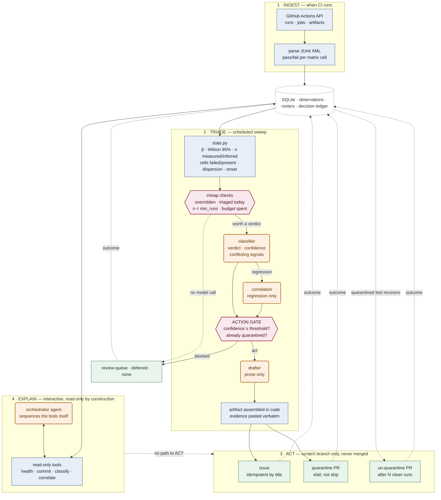

# Architecture

Two paths (ingest and triage), two surfaces (the deterministic pipeline and `explain`), one boundary between
statistics and judgement. **Blue = deterministic Python. Orange = LLM call. Red = the gate, the only place a
judgement becomes a write.**

Every orange box sits inside a blue path: a model never touches the API, the database, or the decision to write.
The first gate disposes of cases before any model is called; the second decides whether a verdict becomes an
artifact. `explain` shares the tools and has no path to `ACT` at all.
